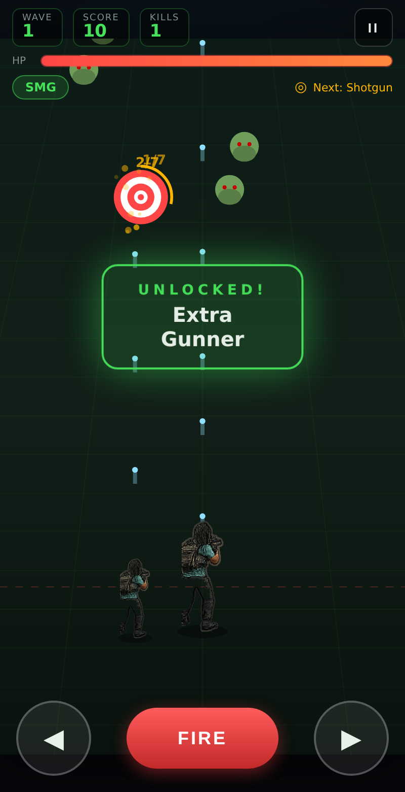

# 🧟 DEAD LINE — Zombie Last Stand

A mobile-first, **install-to-your-phone** zombie shooter you can download straight from GitHub and play. You hold the line at the bottom of the screen, slide side to side, and auto-blast an endless horde. **Shoot the ◎ target enough times to unlock new guns, extra gunners, and permanent upgrades** — exactly the "shoot the target N times to unlock" loop.

Built with pure HTML5 Canvas + vanilla JavaScript. **No installs, no build step, no dependencies** to play — it's a single static folder that runs in any phone browser and installs as a full-screen app (PWA).



---

## ▶️ Play it now (3 ways)

### 1. Play online instantly (GitHub Pages)
Once Pages is enabled on the repo (see below), just open on your phone:

```
https://pv80.github.io/Phone-game/
```

Tap the browser menu → **"Add to Home Screen"** and it installs like a real app — full-screen, offline-capable.

### 2. Download the ZIP and play offline
1. On the GitHub repo page click **Code → Download ZIP**.
2. Unzip it.
3. Open `index.html` — double-click it, or serve the folder (below). On a phone, put the folder on the device and open `index.html` in the browser.

### 3. Run a local server (best for phone-on-same-wifi)
```bash
git clone https://github.com/PV80/Phone-game.git
cd Phone-game
python3 -m http.server 8080     # or:  npm start
```
Then open `http://<your-computer-ip>:8080` on your phone (same Wi-Fi).

> Tip: a local server (or GitHub Pages) enables the service worker, so the game caches itself and works **offline** after the first load.

---

## 🎮 How to play

You're the lone survivor at the bottom — a fully animated sprite-sheet protagonist (idle / aim / fire / take-hit / death frames from `assets/player.png`, with ally gunners drawn from the same art). Zombies pour down from the top. You **fire automatically** — your job is to dodge, aim the lane, and grow your firepower.

| Action | Control |
| --- | --- |
| **Move** left/right | Drag anywhere on screen, or hold the ◀ ▶ buttons (arrow keys / A,D on desktop) |
| **Shoot** | Automatic. Tap **FIRE** for a burst on demand |
| **Unlock** gear | Shoot the flashing **◎ target** the required number of times |
| **Pause** | The `II` button (or `P` on desktop) |

### The unlock loop (the heart of the game)
A bullseye **◎ target** drifts across the top. Land the required number of hits on it before it flees, and you earn the next reward in the ladder:

1. **SMG** → 2. **Extra Gunner** → 3. **Shotgun** → 4. **+40 Max HP** → 5. **Assault Rifle** → 6. **Extra Gunner** → 7. **Minigun** → 8. **Health Regen** → 9. **Extra Gunner** → 10. **Plasma Cannon**

Each target costs a few more hits than the last, so the deeper you go, the harder each unlock is earned.

### Power-ups (drop from kills)
- **+ Health** — restore HP
- **» Rapid Fire** — temporary fire-rate boost
- **◊ Shield** — briefly block all damage
- **×2 Damage** — temporary double damage
- **☢ Nuke** — clear the screen
- **⌇ Gunner** — instantly gain an ally gunner

### Weapons
Pistol → SMG → Shotgun (spread) → Assault Rifle (piercing) → Minigun → Plasma Cannon (heavy piercing splash). More gunners = more of everything, all firing your current weapon.

### Enemies
Walkers, fast Runners, tanky Brutes, Spitters — and a **Boss** every 5th wave. Difficulty and spawn rate climb every wave. Your best score is saved locally.

---

## 🛠️ Project structure

```
Phone-game/
├── index.html              # game shell + HUD
├── css/style.css           # mobile-first UI
├── js/game.js              # the entire game engine (no deps)
├── manifest.webmanifest    # PWA install metadata
├── sw.js                   # service worker (offline + installable)
├── icons/                  # app icons (SVG + generated PNGs)
├── assets/
│   ├── player.png          # protagonist sprite sheet (idle/aim/fire/hit/die)
│   ├── extract_player.py   # regenerates player.png from the source art (bg-keyed)
│   ├── make-icons.js       # regenerates PNG icons (node, no deps)
│   └── smoke-test.js       # headless Playwright test of the game loop
└── .github/workflows/pages.yml  # auto-deploy to GitHub Pages
```

## ✅ Testing it works

A headless browser test drives the real game — start, spawn, shoot, hit the target, unlock weapons/gunners, take damage, game over, restart — and fails if anything throws:

```bash
npm install      # installs playwright (dev only)
npm test         # runs assets/smoke-test.js against system Chromium
```

Expected: `✅ ALL SMOKE TESTS PASSED`.

## 🌐 Enabling GitHub Pages (one-time, by the repo owner)

The included workflow deploys automatically. Just switch Pages to the "GitHub Actions" source:

**Repo → Settings → Pages → Build and deployment → Source: GitHub Actions.**

Every push then publishes to `https://pv80.github.io/Phone-game/`.

## 📄 License

MIT — do whatever you like with it.
